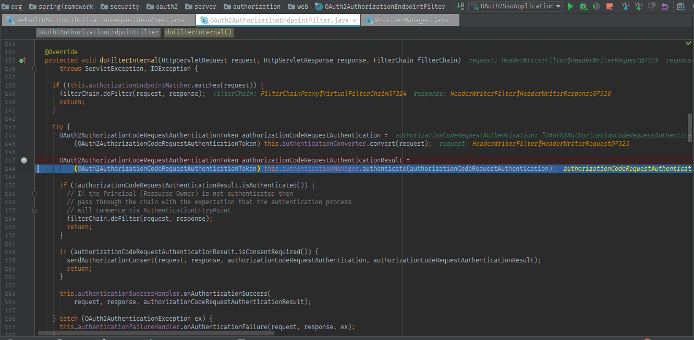

# Read Source Code

## Redirect to login page

1. 访问 http://localhost:8080/authorize?grant_type=authorization_code

2. 如果未登录，会跳转到login page（如：http://auth-server:9000/oauth2/authorize?response_type=code&client_id=messaging-client&scope=message.read%20message.write&state=1QXmFFqMBH-WFnLP1LP23bYXyEZsJz10eOfjt-7_b5Q%3D&redirect_uri=http://localhost:8080/authorized）

   核心逻辑如下图：包括redirectUri的拼接和state的生成

   **DefaultOAuth2AuthorizationRequestResolver**

   

   ```java
   private final StringKeyGenerator stateGenerator = new Base64StringKeyGenerator(Base64.getUrlEncoder());
   ```

- 如何自定义stateGenerator ？

## /oauth2/authorize (生成code)

**OAuth2AuthorizationEndpointFilter**

经过OAuth2AuthorizationEndpointFilter会检查redirectUri的格式是否合法(例如：redirectUri  scheme 不能是localhost)



检查redirectUri的格式是否合法


```Java
private final StringKeyGenerator codeGenerator = new Base64StringKeyGenerator(Base64.getUrlEncoder());
```

```java
String code = this.codeGenerator.generateKey();
OAuth2AuthorizationRequest authorizationRequest = convertAuthorizationRequest(request);

OAuth2Authorization authorization = OAuth2Authorization.withRegisteredClient(registeredClient)
	.principalName(principal.getName())
	.attribute(OAuth2AuthorizationAttributeNames.CODE, code)
	.attribute(OAuth2AuthorizationAttributeNames.AUTHORIZATION_REQUEST, authorizationRequest)
	.build();
```

- 如何自定义codeGenerator ？

## /oauth2/token (code -> token)

**OAuth2TokenEndpointFilter**


**ProviderManager**


**OAuth2AuthorizationCodeAuthenticationProvider**
